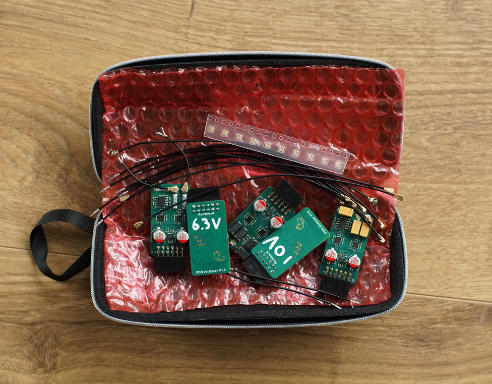
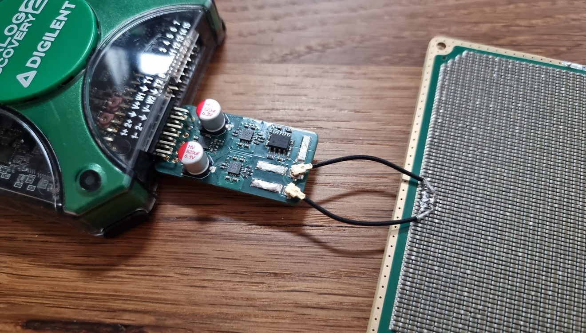
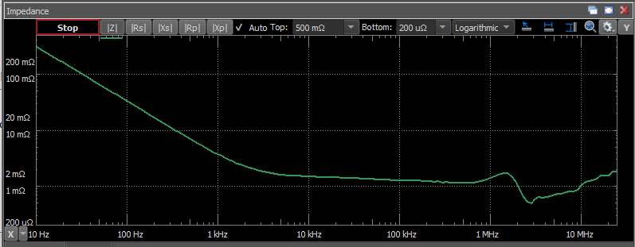
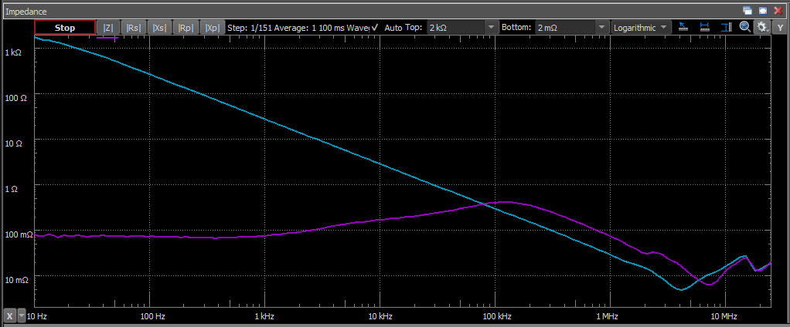
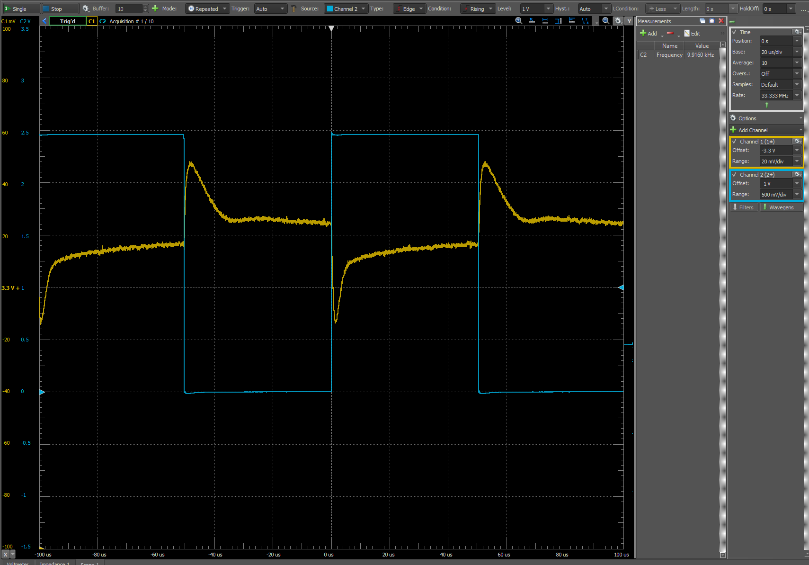
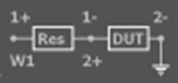
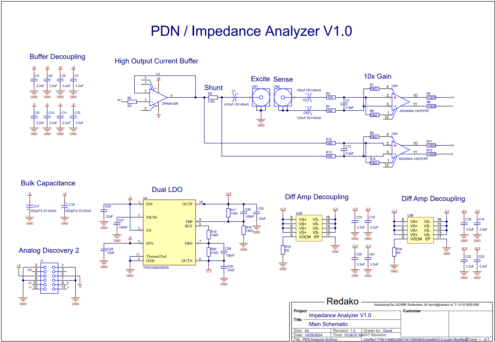
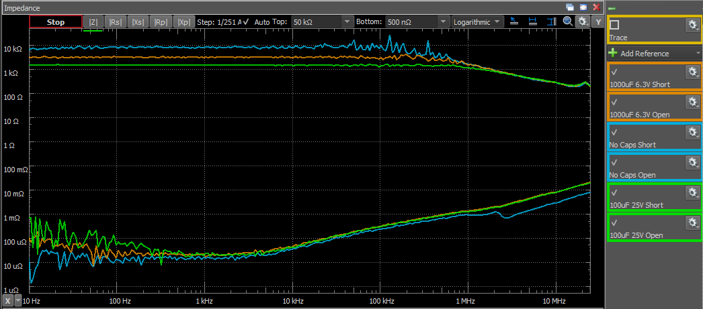
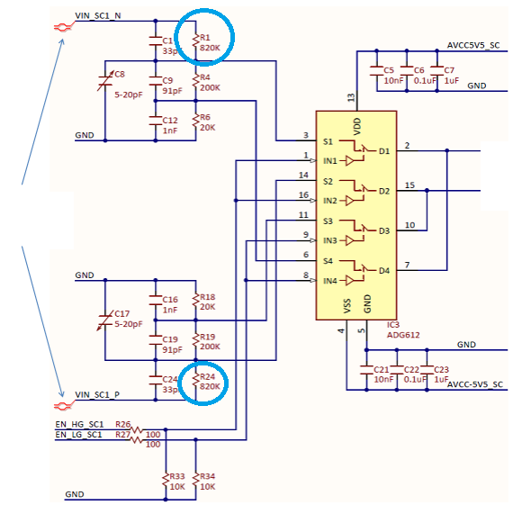
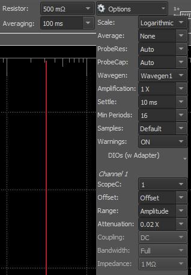

# Redako - PDN Analyzer V1.0

I've been searching for an affordable way to do meaningful Power Delivery Network impedance measurements for quite a while. 

The best purchasable method I found was using a particular type of NanoVNA (that runs from 50kHz onwards) with Joe Smith's now unmaintained version of his NanoVNA windows software. This gave meaningful results! The combination is however some work to set up, buggy, doesn't have the best UI, has the VNA's impedance measurement's typical problem of having ground loop issues (that would require expensive or custom would transformers to mitigate), and only runs from 50kHz onwards (and thus missing a big range of interest for these types of measurements). 

I also tried heavily modifying the circuity of my Analog Discovery 2. In its default configuration it does impedance measurements beautifully, but only down to about an ohm or so. With 20x extra gain, a high current buffer instead of the original waveform buffer chip, and tiny twisted pairs soldered directly to the PCB, I was able to measure impedances down to the milliohm with decent accuracy. While the AD2's UI is a blast to work with, the mechanical setup was a nightmare. The tiny enameled wires kept breaking, I'd need to get DC bias capacitors in there if I wanted to measure something powered one, and I've fried a component on the AD2's circuit board more than once. 

This lead me to design these! Analog Discovery 2/3 extension boards to do DC - 25MHz Power Delivery Network / Impedance analysis measurements. The final (and first) version measures impedance from 10kΩ all the way down to 100µΩ, with and without DC bias, on both powered and unpowered DUTs, basically doing a true 4 wire resistance measurement for AC impedances. 

# Example Measurements

Here I'm measuring a couple of parallel 10uF 0603 capacitors:

This is what the impedance plot looks like: 

From the initial slope we can now for example calculate the [total board capacitance](https://www.omnicalculator.com/physics/capacitive-reactance): with 100mΩ at 30Hz we get 53mF. 

## Nucleo32 3.3V Rail Impedance

I've always found STM32's Nucleo boards super useful. Lets measure the 3.3V rail impedance and see what we get:

In the blue line we have the 3.3V rail impedance when the board is off. Here we mainly see a single capacitance, with a resonance at 4MHz. Reading the ESR at this point we get 5mΩ. Calculating the capacitance like we did with the previous example we get about 5uF. A single 4.7uF capacitor with some 100nFs around? 

Then, with the board on, we get the purple line. The LDO used seems to have about 100mΩ output impedance up to 1kHz, after which it starts rising until the 100kHz mark, where the capacitor starts helping. 

Note that LDOs don't always like current being fed back into them. This means that when measuring its output impedance, there needs to be more current draw from the LDO than is being used as a drive signal. It's easiest to set the drive signal to constant current in such a case, right below what the LDO is supplying. 

When calculating the capacitance of the purple downwards slope at 1MHz now, we get around 2uF - less then half of what we had before. This is the DC bias effect on the ceramic capacitors on the Nucleo board. 

So what kind of supply ripple would we get, driving 100mA of LEDs with a 50% duty cycle 10kHz PWM signal?

The largest swing we see is around 60mV peak to peak. The largest impedance we had in the graph was around 500mΩ. With ~100mA of leds being switched, this seems in the right ballpark.

The lowest ripple we see at this 10kHz switching frequency is around 10mV peak to peak. The impedance we measured at 10kHz was around 150mΩ. This again matches quite well with the 100mA switching current. 

There's a lot of fun to be had here - adding more MLCC's would dampen the initial ripple peak seen after every switching cycle. Adding a good beefy low ESR but high ESL bulk capacitor would dampen the main plateaus, but leave the initial peak intact. But this is besides the scope of these adapter boards. 

# Configuration

This is the measurement configuration:

A shunt is being measured between scope inputs 1+ and 1-, to know the drive current, and the DUT is being measured between 2+ and 2- (the latter of which is connected to ground). 

# Schematics

# Components

- There's a high current buffer (the OPA891) to buffer the waveform generator output with 200mA maximum output current.
  
- There's a 500mΩ shunt in series with this to measure the current.  
  
- There are two fully differential amplifiers (the ADA4940) to give the shunt and DUT signals a 20dB gain
- There's a dual LDO (the TPS7A3901) to power the ADA4940s
- There are are three 7343 Tantalum capacitor footprints to allow measuring DC biased DUTs 
  - The higher the capacitance, the lower the frequency range that can still be measured (since it forms a high pass filter)
  - But you gotta respect Tantalum's voltage ratings or they go poof. 
  - I have separate 0V, 6.3V, 10V, 16V and 25V boards, assembled with a short, 1000uF, 470uF, 220uF and 100uF capacitors. 

# Capacitor Selection

As mentioned above, the measurement range is largest without DC bias capacitors. Here's an image of the usable range three of the assembled boards I have here. One with shorts (cyan), one with 6.3V 1000uF capacitors (orange), and one with 25V 100uF capacitors (green):

The cyan / short goes all the way down to 20µΩ (which sounds realistic for the resistance of my actual short), where the orange and green lines don't make it that far down on the low frequency end. This is due to the DC bias capacitors limiting the current of the drive signal on these lower frequencies (due to the capacitor's own AC impedance). 

The slope from 3kHz onwards is actual inductance being measured. With 1mΩ reactance at 1MHz we get about 150pH inductance - equivalent to maybe half a mm of wire. The AD2 isn't great at separating reactance from resistance, as it's measuring phase shift in software rather than hardware, but there is a way to view these separately if one is interested. 

The capacitors also limit the maximum impedance that can be measured over the entire frequency range, seen at the top, but this luckily isn't an issue for the ranges I'm interested in. 

# Extra resolution

If you dare you can short the Analog Discovery 2's 820k input attenuation resistors to get an extra 5x gain, but you'd have to be careful not to fry the buffers. I have done this on my AD2 (both the mod, and frying and replacing the buffers).

# Software

It runs on the Digilent Waveforms software. There's a configuration supplied in the files. I have the gain set to 0.02x. If you don't modify the Analog Discovery's input circuits it should be set to 0.1x for both channels:

# License

### CC BY-NC 

