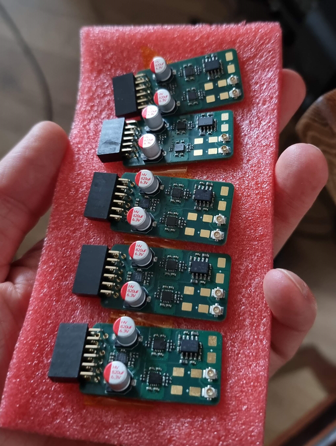

# Redako PDN Analyzer V1.0

These are Analog Discovery 2/3 extension boards to do DC - 25MHz Power Delivery Network / Impedance analysis. It measures impedance from ??? all the way down to 100µΩ, with and without DC bias, on both powered and unpowered DUTs. 
